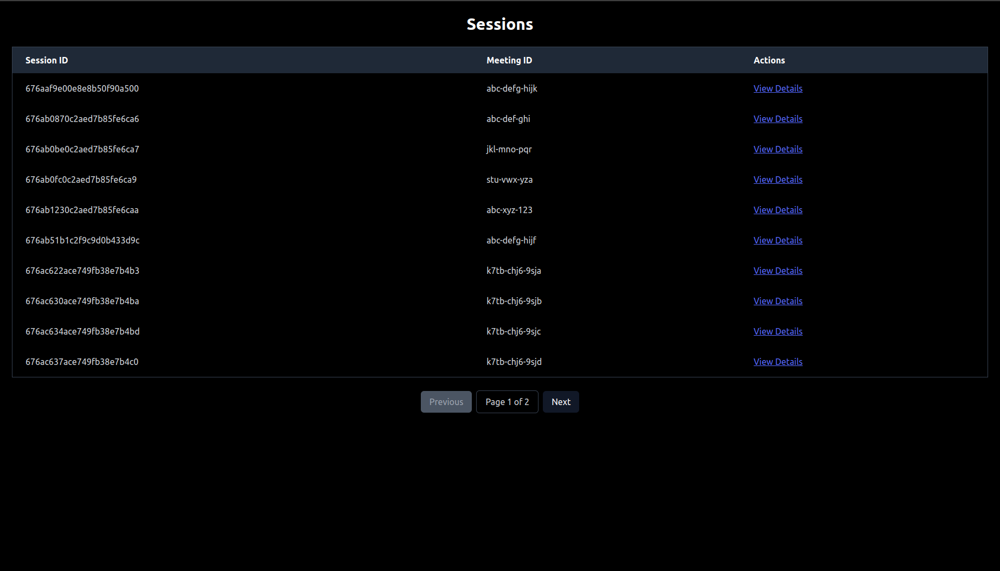
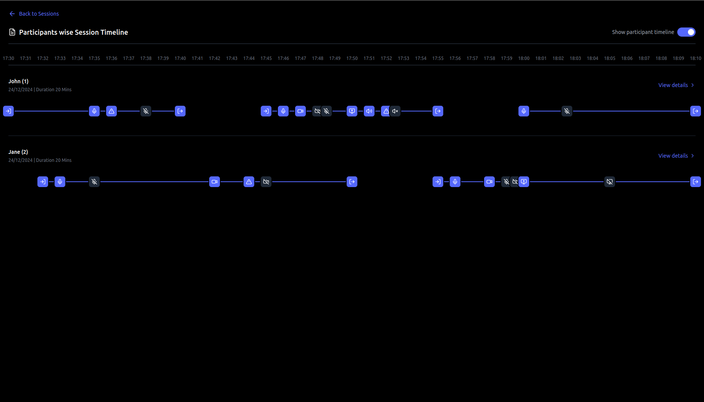

# Session Timeline Application

## Overview
The Session Timeline Application is designed to manage and track video/audio session timelines. The application has two main components:
1. **Backend**: Built with Node.js and Express with Typescript to handle session management and API operations.
2. **Frontend**: Developed with React.js to provide a user-friendly interface for interacting with session data.

Both components have been deployed for ease of use. You can test the application directly without any setup using the following links:
- **Backend Deployed Link**: [https://session-timeline-for-video-and-audio.onrender.com](https://session-timeline-for-video-and-audio.onrender.com)
- **Frontend Deployed Link**: [https://session-timeline-for-video-and-audio.netlify.app/](https://session-timeline-for-video-and-audio.netlify.app/)

---

## Project Structure

### Backend
The backend folder contains the server-side application that manages session data and provides REST APIs.

#### Folder Structure
```
backend/
├── controllers/
│   └── sessionController.js
├── routes/
│   └── sessionRoutes.js
├── models/
│   └── sessionModel.js
├── app.js
├── package.json
├── .env
```

#### Key APIs
The backend provides the following REST APIs to manage session data:

- **Get All Sessions**:
  ```
  GET /sessions
  ```
  Retrieves a list of all sessions.

- **Get Specific Session**:
  ```
  GET /sessions/:id
  ```
  Retrieves details of a specific session by ID.

- **Start a New Session**:
  ```
  POST /sessions/start
  ```
  Starts a new session.

- **Add a Participant**:
  ```
  POST /sessions/:meetingId/participant
  ```
  Adds a participant to a session.

- **Leave Participant**:
  ```
  POST /sessions/:meetingId/leave-participant
  ```
  Removes a participant from a session.

- **Log an Event**:
  ```
  POST /sessions/:meetingId/log-event
  ```
  Logs an event (e.g., start/stop audio, video).

- **End Session**:
  ```
  POST /sessions/:meetingId/end
  ```
  Ends an ongoing session.

#### Setup Instructions
1. Navigate to the backend folder:
   ```bash
   cd backend
   ```
2. Create a `.env` file with the following variables:
   ```env
   MONGO_URI=mongodb+srv://<USERNAME>:<PASSWORD>@imdb.46rj40h.mongodb.net/session-db?retryWrites=true&w=majority
   PORT=5000
   ```
3. Install dependencies:
   ```bash
   npm install
   ```
4. Run the backend server locally:
   ```bash
   npm run dev
   ```

---

### Frontend
The frontend folder contains the React.js application for interacting with the session data.

#### Folder Structure
```
frontend/
├── src/
│   ├── components/
│   └── App.js
├── public/
├── package.json
```

#### Features
- Displays all sessions retrieved from the backend.
- Allows viewing of a specific session.
- Uses REST APIs for fetching session data.

#### Setup Instructions
1. Navigate to the frontend folder:
   ```bash
   cd frontend
   ```
2. Install dependencies:
   ```bash
   npm install
   ```
3. Run the frontend locally:
   ```bash
   npm start
   ```

---

## Deployment

Both the backend and frontend have been deployed. You can access the application using the links below:
- **Backend**: [https://session-timeline-for-video-and-audio.onrender.com](https://session-timeline-for-video-and-audio.onrender.com)
- **Frontend**: [https://session-timeline-for-video-and-audio.netlify.app/](https://session-timeline-for-video-and-audio.netlify.app/)

Since the application is deployed, no setup is required for testing.

---

## Conclusion
This documentation provides an overview of the application structure, setup instructions, API details, and deployed links. The project is designed to be scalable and user-friendly, making it easy to manage session timelines effectively. For any queries, feel free to reach out!


Session


Participants wise session timeline
